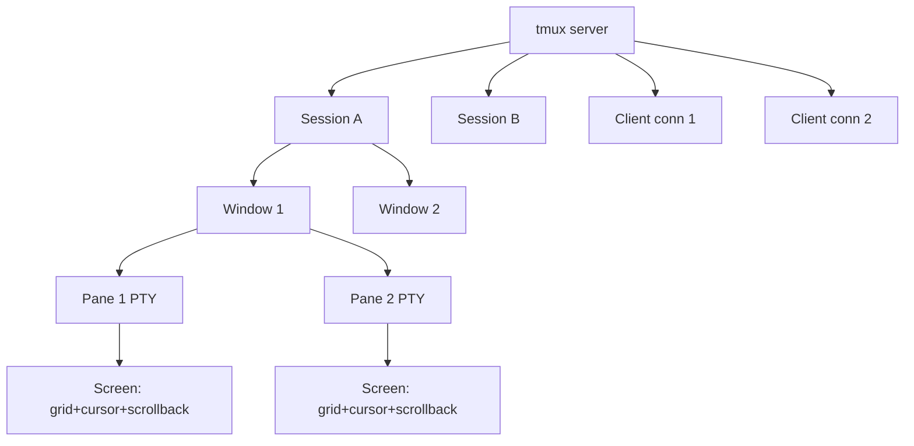

# tmux Competitive Research

## Core Architecture Lessons for z3rm

### Server-Owned PTYs + Screen Model
- **Server owns all PTYs**: tmux server process owns all pseudo-terminals. Clients connect via Unix socket and request operations. This enables session persistence across client disconnects/reconnects—critical for z3rm's session persistence goal.
- **Screen model per pane**: Each pane owns a "screen" (terminal state machine + scrollback buffer). The server maintains a tree of windows → panes → screens. z3rm's `TerminalView` + `TerminalViewState` split mirrors this cleanly.

### Recursive Layout Tree with Checksummed Serialization
- **Layout as recursive tree**: Windows contain panes (horizontal/vertical splits recursively). Each node has geometry + child reference. Serialization includes checksums for corruption detection—critical for z3rm's session persistence/resume.
- **Layout serialization format**: Binary format with version + checksum. On resume, validate checksum; if mismatch, reconstruct default layout. z3rm's `Workspace` persistence should adopt similar versioned, checksummed layout serialization.

### Versioned Wire Protocol from Day One
- **Protocol version in every message**: First byte = protocol version. Server speaks multiple versions simultaneously. Clients negotiate on connect. z3rm's mux protocol (Plan 9) must version from day one—no "v2 later" migrations.
- **Request/response + notifications**: Request/response for commands; async notifications for output/events. z3rm's mux protocol should adopt this pattern: request/response for control plane, async notifications for PTY output/events.

### Prefix Key Model (Prefix Key + Command Key)
- **Prefix key (default `C-b`)**: Prefix key enters "command mode"; next key triggers command. Avoids chord conflicts with apps. z3rm's keymap system (Plan 17) should support prefix-key mode as first-class keymap mode.
- **Command table keyed by key**: Command table maps key → command. Prefix key switches active command table. z3rm's keymap system should support modal keymaps natively.

### Lessons Applied to z3rm
1. **Server owns PTYs from day one** — Plan 10 (mux-server) owns PTYs; clients are thin.
2. **Versioned wire protocol from day one** — Plan 9 (mux-protocol) versions every message.
3. **Layout tree with checksummed serialization** — Plan 15 (workspace) serializes layout tree with version + checksum.
4. **Prefix-key keymap mode** — Plan 17 (keymap) supports modal keymaps including prefix mode.
5. **Server-owned PTYs enable session persistence** — Core z3rm value prop: sessions survive client disconnect.
## Strategic Context for z3rm

z3rm diverges from tmux by using multi-process architecture (mux-server per session), protobuf wire protocol with version negotiation, GPU-accelerated terminal rendering via GPUI, and QuickJS extension host. However, tmux's proven session/window/pane hierarchy and prefix-key interaction model are design patterns worth inheriting. tmux's single-process C design is legacy; z3rm's Rust + GPUI stack is a clean break.

## Key Files to Reference (tmux Ideas)
- `server.c` — Event loop, client handling (informs Plan 10 mux-server event loop design)
- `session.c` / `window.c` / `pane.c` — Session/window/pane ownership (informs Plan 15 workspace layout tree)
- `tty.c` — PTY handling (informs Plan 10 PTY thread)
- `screen.c` — Grid + scrollback (informs terminal-view grid design)
- `cmd-*.c` — Command dispatch table (informs Plan 17 keymap command dispatch)