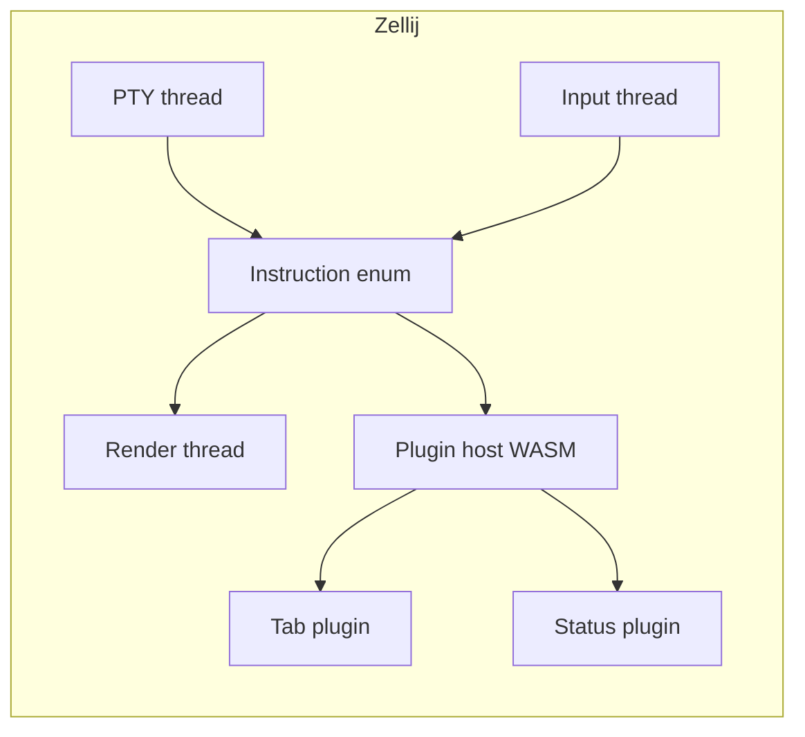

# Zellij Competitive Research

## Core Architecture Lessons for z3rm

### Thread-Per-Concern Actor Model with Typed Instruction Enums
- **Thread-per-concern**: Zellij spawns dedicated threads per concern (PTY thread, render thread, input thread, plugin host, CLI server). Each thread owns its state; communication via typed `Instruction` enums over MPSC channels. No shared mutable state. z3rm's mux-server (Plan 10) should adopt: PTY thread, grid thread, client-handler threads, plugin host thread—each with typed instruction enums.
- **Typed instruction enums**: Every cross-thread message is a typed enum variant (`Instruction::PtyBytes`, `InstructionRender`, `InstructionPlugin`). Exhaustive matching catches missing handlers at compile time. z3rm's mux protocol (Plan 9) should define typed instruction enums for server↔client and inter-thread communication.

### All Chrome as Plugins (WASM)
- **UI chrome = plugins**: Tabs, status bar, pane frames, session manager—all are WASM plugins. Core is headless multiplexer. Plugins communicate via host↔plugin protocol (WASI + custom host functions). z3rm's extension system (Plan 14, QuickJS) should adopt: tabs, status bar, tab bar, command palette as first-party "builtin" extensions using same host API as third-party extensions.
- **WASM plugin host with capability permissions**: Plugins declare capabilities (read files, spawn commands, read clipboard). Host enforces at host-function boundary. z3rm's extension host (Plan 14) should adopt capability-based permission model from day one.

### prost Protobuf with Forward-Compatibility Contract
- **prost for wire protocol**: All wire messages are prost (protobuf) messages. Fields are optional with defaults; unknown fields preserved. Adding fields never breaks old clients. z3rm's mux protocol (Plan 9) should use prost/protobuf with explicit `optional` fields and `reserved` field numbers for future use.
- **Version negotiation on connect**: Client sends supported protocol versions; server picks highest common. z3rm's mux protocol handshake must include version negotiation from day one.

### Avoid God-Object Files
- **No god modules**: Zellij splits concerns into focused crates: `zellij-tile` (layout), `zellij-utils` (shared), `zellij-tile-utils` (panes), `zellij-tile-plugin` (plugin host). No single file exceeds ~500 lines. z3rm's crate structure (crates/mux-server, crates/mux-client, crates/mux-protocol, crates/terminal-view) should enforce similar crate-level boundaries—no god crates.

### Lessons Applied to z3rm
1. **Thread-per-concern actor model** — Plan 10 (mux-server): PTY thread, grid thread, client handler threads, plugin host thread with typed `Instruction` enums.
2. **All chrome as first-party extensions** — Plan 14 (QuickJS extensions): tabs, status bar, command palette as builtin extensions using same host API.
3. **prost protobuf with forward-compat** — Plan 9 (mux-protocol): prost messages, optional fields, version negotiation on connect.
4. **Crate-level boundaries, no god crates** — Crate structure enforces separation: mux-server, mux-client, mux-protocol, terminal-view, workspace, extensions.
5. **Plugin capability permissions from day one** — Plan 14 (extensions): capability declarations enforced at host-function boundary.

## Strategic Context for z3rm

zellij's thread-per-concern actor model validates thread isolation for terminal multiplexers. Each concern is self-contained, communicating via typed Instruction enums. This is the pattern z3rm's mux-server (Plan 10) follows with PTY-thread, grid-thread, client-handler-threads, and plugin-host-thread.

The "all chrome as plugins" design — where tabs, status bar, pane frames are WASM plugins — demonstrates that a headless multiplexer core with UI-as-extensions is viable. z3rm extends this by making builtins first-party QuickJS extensions (Plan 14), sharing the same host API as third-party extensions from day one.

## Key Source Patterns to Adapt
- **Typed instruction enums** (`zellij-utils/src/input_handler.rs`, `zellij-server/src/ptty.rs`) — exhaustive match for all messages; compiler catches missing handlers.
- **prost protobuf** (`zellij-utils/src/data.rs`) — optional fields, forward-compatible wire format. Directly informs Plan 9 mux-protocol.
- **Plugin capability system** — plugins declare capabilities at manifest time; host enforces per-call.
- **Crate separation** — no god crates; each concern isolated in its own crate. z3rm crate map mirrors this.